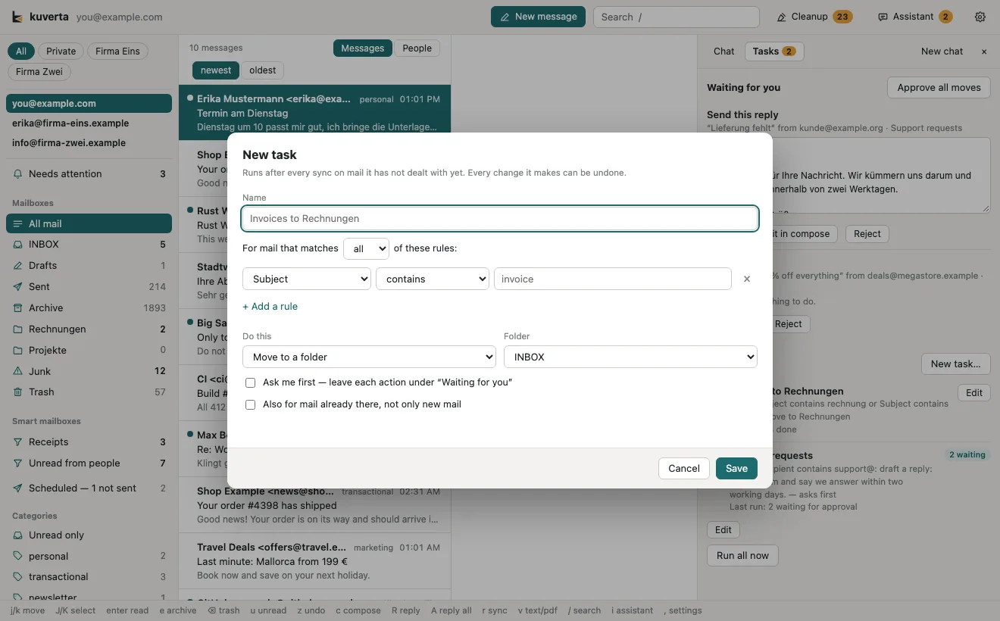

# Assistant and tasks

The **Assistant** button in the header (or <kbd>i</kbd>) opens a panel on the
right with two tabs: **Chat**, to ask about your mail or say what to do with it,
and **Tasks**, the standing jobs it — or you — set up.

## Chat

Ask as you would ask a person: *"What needs my attention today?"*, *"Find my
invoices from this month"*, *"Summarise the unread mail from people"*, *"Archive
the newsletters I haven't opened in a month"*, *"Draft a reply to Erika saying
Tuesday works"*. It works on the account on screen, and starts afresh with
**New chat** or when you switch accounts.

It answers by using tools, and each thing it does shows in the conversation as
it happens:

- **Looking** — search, lists, reading a message, the [Needs attention](attention.md)
  ranking, a [conversation](people.md) — shows as a grey line: *"searched for
  invoice — 12 found"*.
- **Changing** — move, archive, trash, mark read, file under a category, create a
  folder — shows as a card with **Undo**. Every change is an ordinary queued
  change: it waits before it reaches the server, and Undo takes exactly those
  changes back while they wait.
- **Replying** — the assistant never sends mail. A reply it drafts appears as a
  card you can edit, then **Send** (after a confirmation) or **Open in compose**.
- **Tasks** — when you say *always*, *automatically* or *from now on*, it creates
  a task (below) and shows its rules in words and how many messages they match
  now, so a rule that catches too much or too little shows before it acts.

Before moving or trashing more than 30 messages it says how many and asks.

### Working on a message you have open

**Ask the assistant** on an open message — or <kbd>Shift</kbd>+<kbd>I</kbd> on
the message under the cursor, or on several you have picked — hands it over
with your question. The messages show above the chat box, each with **×** to
leave one out, and what you ask is about those:

- *"Reply and confirm the appointment."*
- *"What does this need from me?"*
- *"Write a summary of this for clara@example.com so I can send it."*

It gets the text of those messages with the question, so it answers without
searching first — which matters with a small model. Up to five messages go
along, and about four pages of each.

A reply comes back as a card you can edit and **Send**, or **Open in compose**;
a message to somebody else comes back the same way, addressed to whoever you
named. The assistant never sends either of them.

### Finding a message

*"I got an eSIM by mail a while ago — how do I get to it?"*, *"Where is the
contract from the gym?"*, *"Find the train tickets for Hamburg."* The assistant
searches all your stored mail, however old, and tries the ways the message could
put it: other spellings, German and English words, the parts of a compound word,
the likely sender. When it has found the message it shows it as a **card**:
subject, sender and date, a line on what it found, **Open message**, and the
message's [attachments](reading.md#attachments) — click one to see it straight
from the chat. That is where the QR code of an eSIM, a ticket or a contract
usually is; the assistant can read the message's text and tell you what it says
to do, but it does not look inside attachments itself.

## Tasks

A task is a standing job done to mail as it arrives: which mail (the same rules
as a [smart mailbox](smart-mailboxes.md)) and what to do with each message.

| Action | Needs a model | |
| --- | --- | --- |
| Move to a folder, Archive, Move to Trash, Mark read, File under a category | no | Done to every matching new message. |
| **Draft a reply** | yes | The model writes a reply from your instruction ("thank them, say we answer within two working days, ask for the order number"). Always waits for you. |
| **Let the model decide** | yes | The model reads each message and picks one of the actions above, a reply, or nothing, by your instruction. |

Tasks run after every sync, on mail they have not dealt with yet — each message
once. **Run all now** runs them straight away. A new task deals only with mail
that arrives from then on, unless you tick **Also for mail already there**.

**Ask me first** makes a task leave each action under **Waiting for you**
instead of doing it: **Approve** (or **Approve all moves**) does it, **Reject**
drops it. A drafted reply always waits there: **Send** it, **Edit in compose**
first, or **Reject** it. The Assistant button shows how many are waiting.

Make a task by asking the assistant, or with **New task…**; the editor shows how
many messages the rules match while you write them. Switch one off with its
checkbox, or change or delete it with **Edit**.

## Which model

The assistant needs a model that can call tools, and does better the larger it
is. It uses the model for sorting mail until you give it its own in
**Settings → Models → The assistant**; **Try them** checks that the model you
chose actually calls tools. Small local models (3B) can answer questions but
often fumble tasks — and searching several times with different words, which is
what finding an old message takes; a 7–14B local model, or a hosted one, does
much better. Without any model, the [search box](reading.md#searching) finds
*esim* in *e-SIM* too.

With a hosted model, what the assistant reads — whatever it searches for and
opens — is sent to that service; the line under the chat says which model is
answering and where. Tasks that ask a model send the message they are about.

Some hosted services filter what they are sent, and refuse a request when
something in it trips the filter — spam and phishing mail do. DeepSeek answers
*Content Exists Risk*. The assistant then asks once more with the mail from that
question left out, and tells you some mail could not be read; if the service
refuses again, it says so. A model on this computer has no such filter.
