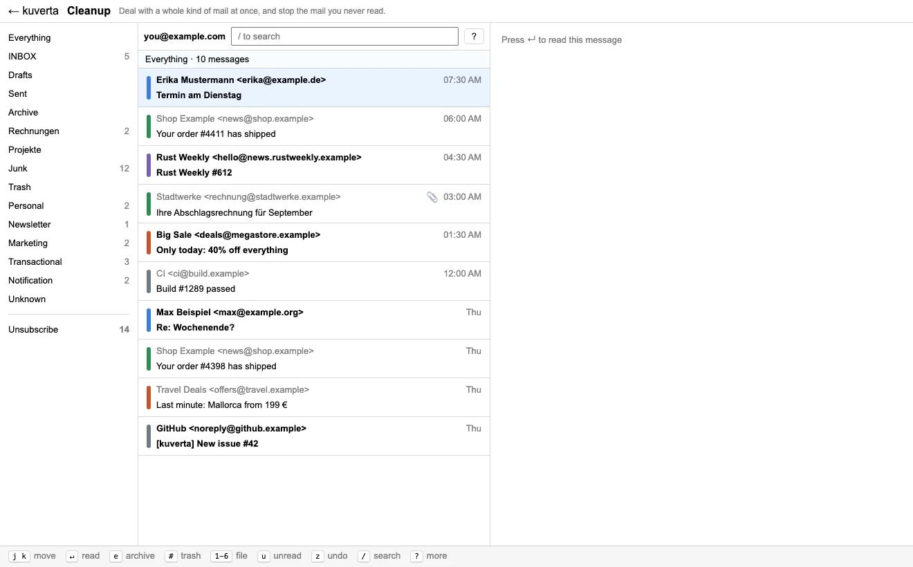
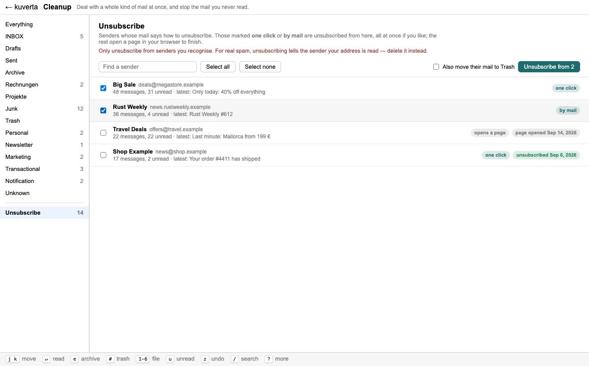

# Cleanup and unsubscribing

Most of a mailbox was not written to you. Newsletters, receipts, alerts and
adverts arrive in the same list as the few messages that need an answer, and in
an Inbox they all look equally like work. **Cleanup** is for dealing with them a
whole kind at a time — and for stopping the ones you never read.

## The count in the header

**Cleanup** in the header carries a number: the newsletters, marketing and
notifications **still in your Inbox**. Hover over it to also see how many
senders you could unsubscribe from. Click it to open Cleanup; **← kuverta** at
the top left takes you back.

## Working through mail by category

The left side lists **Everything**, the account's mailboxes, and the six
[categories](reading.md#categories); pick one and the list shows only that. If
you have more than one account, choose which one at the top. If you have post,
each postal address is listed too, and **Everything** shows mail and post
together, newest first.

The keys are the ones from the main window, plus filing:

| Key | |
| --- | --- |
| <kbd>j</kbd> / <kbd>k</kbd> | move down and up |
| <kbd>Enter</kbd> | read the message, with why it has its category |
| <kbd>e</kbd> | archive |
| <kbd>#</kbd> or <kbd>Delete</kbd> | move to Trash |
| <kbd>u</kbd> | read / unread |
| <kbd>1</kbd>–<kbd>6</kbd> | file as personal, newsletter, marketing, transactional, notification, unknown |
| <kbd>z</kbd> | undo |
| <kbd>/</kbd> | search |
| <kbd>r</kbd> | sync |
| <kbd>?</kbd> | what Cleanup is for, and every key |
| <kbd>Esc</kbd> | close the message, or clear the filter |

As in the main window, acting on a message keeps your place, and changes wait in
the same [undo window](reading.md#undo) before they reach the server.

Filing with a number is a correction: from then on, that sender or list is filed
the way you said.

## Unsubscribe

Below the categories is **Unsubscribe**, with a count: every sender whose mail
says how to unsubscribe (a `List-Unsubscribe` header) and whom you have not
unsubscribed from yet.

Senders are grouped by mailing list, or by address when there is no list, and
each row shows how many messages they have sent, how many are unread, and the
latest subject. **Find a sender** narrows the list. The chip on the right says
how the sender can be unsubscribed:

| Chip | What kuverta does |
| --- | --- |
| **one click** | Sends the one request the sender's header asks for, as RFC 8058 describes — made for exactly this, and safe to automate. |
| **by mail** | Sends the unsubscribe mail the sender asks for, from your account. |
| **opens a page** | The sender only offers a web page. kuverta opens it in your browser for you to finish there. |

Tick the senders you want — or **Select all** — and press **Unsubscribe from N**.
Senders marked *one click* and *by mail* are unsubscribed from right there.
Senders that only offer a page are collected in a bar that opens them **five at
a time**, so a long list does not open fifty browser tabs at once.

kuverta **never follows an ordinary unsubscribe link on its own.** Visiting one
tells the sender that your address is read, and most of those pages want a
click anyway.

Each row remembers what happened: *unsubscribed* with the date, *page opened*
with the date, or *failed* — hover over it for the reason.

### Also moving their mail to the Trash

Tick **Also move their mail to Trash** before pressing Unsubscribe to clear out
everything those senders have sent, too. Every message is moved as its own
queued change, like any other delete, so <kbd>z</kbd> in the main window can
still bring them back while they wait to be sent.

!!! warning "Unsubscribe only from senders you recognise"
    For real spam, unsubscribing — by any method — confirms to the sender that
    your address exists and is read, and brings more of it. Delete spam instead,
    and let kuverta offer the [messages like it](similar.md).

The first time you open Unsubscribe, kuverta reads the unsubscribe headers of
mail that was synced before it kept them. On a large mailbox that takes a moment
and says how far it has got.
