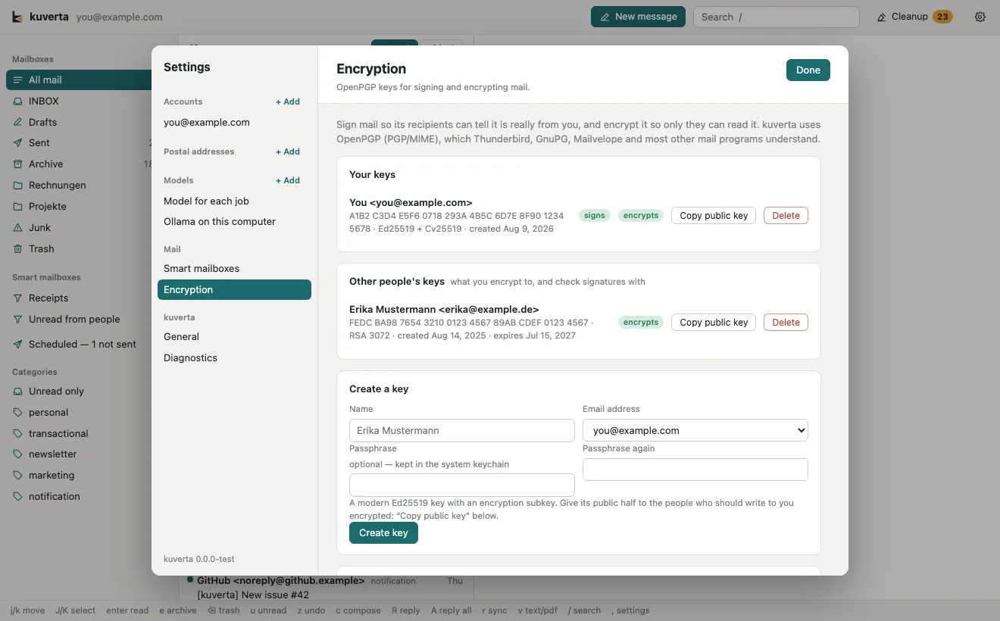
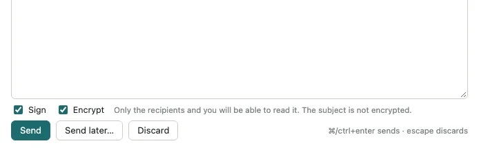
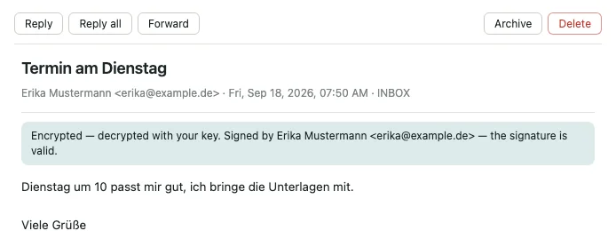

# Encryption

kuverta signs and encrypts mail with **OpenPGP**, in the PGP/MIME format
(RFC 3156) that Thunderbird, GnuPG, Mailvelope and most other mail programs
understand. It uses its own OpenPGP implementation, written in Rust
([rPGP](https://github.com/rpgp/rpgp)), so there is no GnuPG to install and no
agent to run.

- **Signing** lets the recipient check that a message is really from you and
  was not changed on the way.
- **Encrypting** means only the recipients — and you — can read it.

## Keys

Keys are managed in **Settings → Encryption**.

**Your keys** are the ones you have the secret half of: they sign what you send
and decrypt what is sent to you. **Other people's keys** are what you encrypt to
and check signatures with. Each key shows its fingerprint, algorithm, when it
was created and when it expires, and chips for what it can do: **signs**,
**encrypts**, or **expired**, **revoked**, and **needs passphrase** when kuverta
has a secret key it cannot unlock yet.

For each key:

- **Copy public key** puts the public half, armored, on the clipboard — to paste
  into a message, onto a key server, or wherever your correspondents look for it.
  Secret keys are never exported.
- **Passphrase…** opens a field for the key's passphrase. It is checked against
  the key before it is kept.
- **Delete** removes it. Deleting one of *your* keys means mail encrypted to it
  can never be read again unless you have a copy of the key elsewhere, and
  kuverta asks before it does it.

### Creating a key

Under **Create a key**, enter your name, choose one of your account addresses,
and optionally a passphrase (twice). kuverta makes an **Ed25519** signing key
with a **Curve25519** encryption subkey — GnuPG's own default — that does not
expire.

The secret key is always protected by a passphrase on disk. If you do not give
one, kuverta makes one up and keeps it in the system keychain, as it does with
a passphrase you type.

Then give your public key to the people who should write to you encrypted:
**Copy public key**, and send it to them.

### Importing keys

Under **Import keys**, paste armored text — one key or several, public or
secret, in one go — or **Choose a file…** (`.asc`, `.gpg`, `.pgp`, `.txt`,
`.key`). Every key must pass its self-signature check before it is accepted; the
result line says what was imported, what was updated, and what was not and why.

If you already use a key in another program, import its secret key here and
store its passphrase with **Passphrase…**.

A message that carries a public key (as an `application/pgp-keys` attachment)
shows **Import the attached key** above its text.

### Where keys are kept

Keys are files in the `pgp/` folder of the [data directory](privacy.md#on-your-computer)
— one armored certificate per key, and for your own keys the passphrase-protected
secret key beside it, readable only by you. Passphrases are kept in the system
keychain and, like account passwords, are written there and never shown again.
Back the `pgp/` folder up if you rely on your keys.

## Writing signed or encrypted mail

**Sign** and **Encrypt** appear under the message once there is any key to use —
yours or a recipient's.

- **Sign** needs a secret key of your own for the account you are sending from.
- **Encrypt** needs a key for **every To and Cc recipient, and for you**, so the
  copy filed in Sent stays readable to you. When a key is missing, the line
  beside the switches says whose; import it in Settings → Encryption to encrypt.
- **Encrypted mail cannot have Bcc.** An encrypted message names the key of
  everyone it is encrypted to, in the clear, so encrypting to a blind recipient
  would tell everyone else who was blind-copied. Encrypt is switched off while
  there is anything in Bcc.
- **The subject is not encrypted.** Only the text is; the subject line travels
  as it would in any message, so do not put anything in it you would not put on
  an envelope.

A reply to an encrypted or signed message starts with **Encrypt** and **Sign**
ticked, when they can be. Mail scheduled with [Send later](writing.md#send-later)
keeps its Sign and Encrypt choice until it is sent.

A signed message is sent as `multipart/signed`, with its text re-encoded so mail
servers on the way have no reason to change it and break the signature. A
message that is signed and encrypted is one `multipart/encrypted` message,
signed inside.

From the command line, `kuverta send … --sign --encrypt` does the same; see
[the command line](../developers/cli.md#sending). The [MCP server](../developers/mcp.md)
cannot sign or encrypt: an assistant's drafts stay plain.

## Reading signed or encrypted mail

A note under the subject says what kuverta checked and what it found:

| The note says | Means |
| --- | --- |
| Encrypted — decrypted with your key. | It was encrypted to you, and kuverta opened it. |
| Encrypted, and kuverta could not decrypt it: … | With the reason — for example that you have no secret key for it, or its passphrase is not stored. **Encryption settings** takes you there. |
| Signed by … — the signature is valid. | The message is exactly as the signer sent it. |
| … the signature is valid, but that is not who the message says it is from. | A real signature by someone other than the sender. Treat it with suspicion. |
| The signature from … does not match: the message may have been changed on the way. | Something altered the message after it was signed. |
| Signed with a key kuverta does not have (…). | Import the sender's key to check it. |

Inline PGP — a message whose text is `-----BEGIN PGP MESSAGE-----` or
`-----BEGIN PGP SIGNED MESSAGE-----` — is read too.

## Not there yet

- Encrypting the subject (protected headers)
- Autocrypt, and finding keys automatically on key servers or through WKD
- Exporting secret keys
- Managing expiry and revocation of keys in the window
- S/MIME
