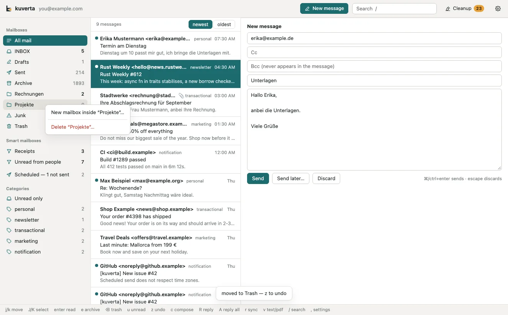

# Mailboxes

The **Mailboxes** section of the sidebar lists the account's folders on the
server, each with its unread and total counts. **All mail** at the top shows
every message of the account in one list.

Mailboxes are the server's: creating or deleting one here changes it for every
mail program you use with that account.

## Creating a mailbox

- Press **+** beside *Mailboxes* in the sidebar, or
- right-click a mailbox and choose **New mailbox inside "…"**.

Give it a name and choose where it goes — **Inside** one of the existing
mailboxes, or *Nowhere — at the top*. **Create** makes it on the server
straight away; a mailbox holds no mail yet, so there is nothing to wait for or
undo.

Servers that come without an Archive folder — many plain Dovecot setups do —
need one before <kbd>e</kbd> can archive anything. Create a mailbox called
`Archive` here.

## Deleting a mailbox

Right-click the mailbox and choose **Delete "…"**. kuverta asks first.

Deleting a mailbox on an IMAP server deletes every message in it, so kuverta
only ever deletes an **empty** one. It refuses:

- the **Inbox**, **Sent**, **Drafts**, **Archive**, **Junk** and **Trash** (and
  Gmail's *All Mail*) — the mailboxes the account keeps its own kinds of mail in (the menu item is greyed
  out for them);
- a mailbox that has **mailboxes inside it**;
- a mailbox that still holds mail — as kuverta counts it, and again as the
  server says immediately before deleting. Move the messages out first.

When it refuses, it says why.

## Mailboxes that are not synced

Each account can leave some mailboxes out of the sync — useful for Gmail's
*All Mail*, which holds a second copy of everything. See
[Settings → Accounts](settings.md#accounts).
