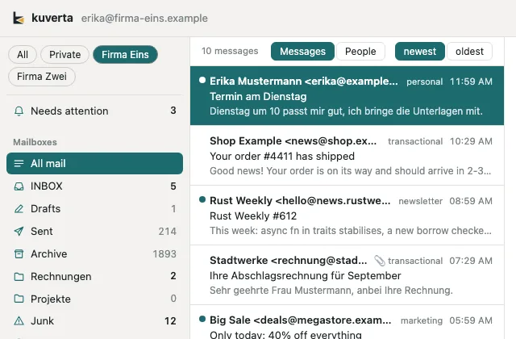
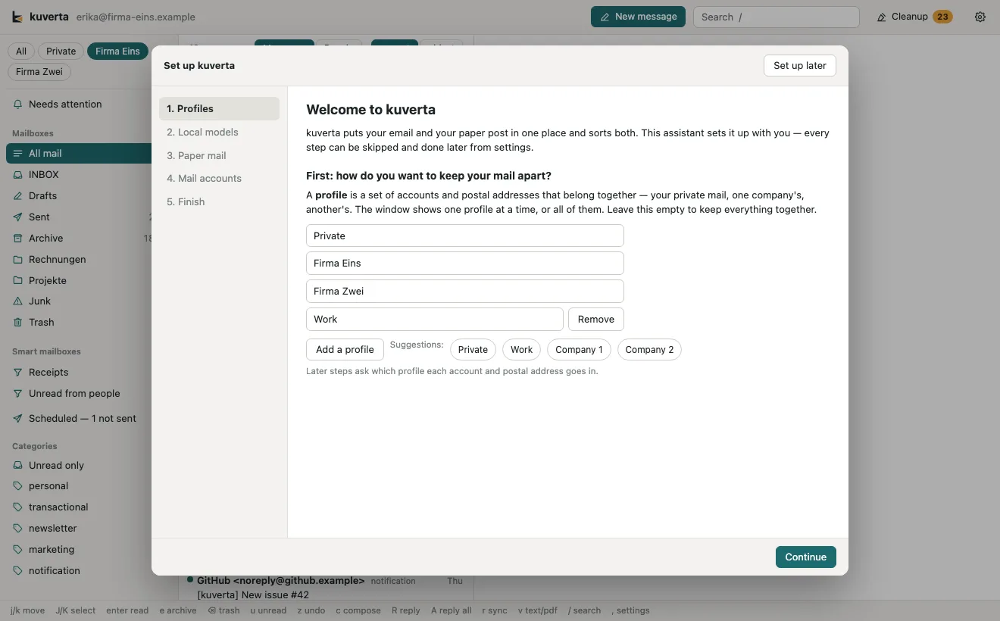
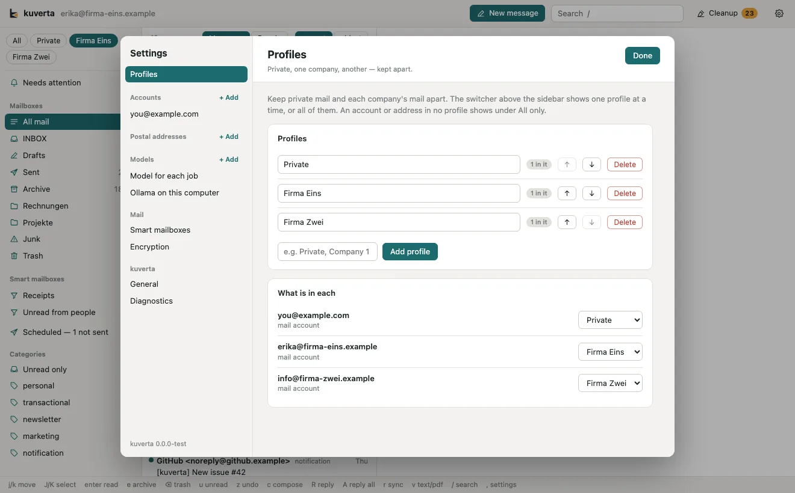

# Profiles

A **profile** is a set of mail accounts and postal addresses that belong
together: your private mail, one company's, another's. The window shows one
profile at a time, or all of them.

## Switching

The switcher sits at the top of the sidebar once there is at least one profile:
**All**, then each profile. Choosing one shows only its accounts and addresses;
if the account you were reading is not in it, kuverta moves to the profile's
first. The choice is kept the next time kuverta opens.

An account or address in no profile shows under **All** only.

## Setting them up

The [setup assistant](index.md) asks first: add a row per profile (or take one
of the suggestions), and the later steps ask which profile each account and
postal address goes in.

Afterwards, **Settings → Profiles** lists them: rename one by typing over its
name, move it up or down, delete it, or add another. Underneath, **What is in
each** has every account and address with its profile, to change in one place.
The account and address forms have a **Profile** field too, and a new account
starts in the profile on screen.

Deleting a profile deletes nothing else: its accounts and addresses stay, in no
profile.
