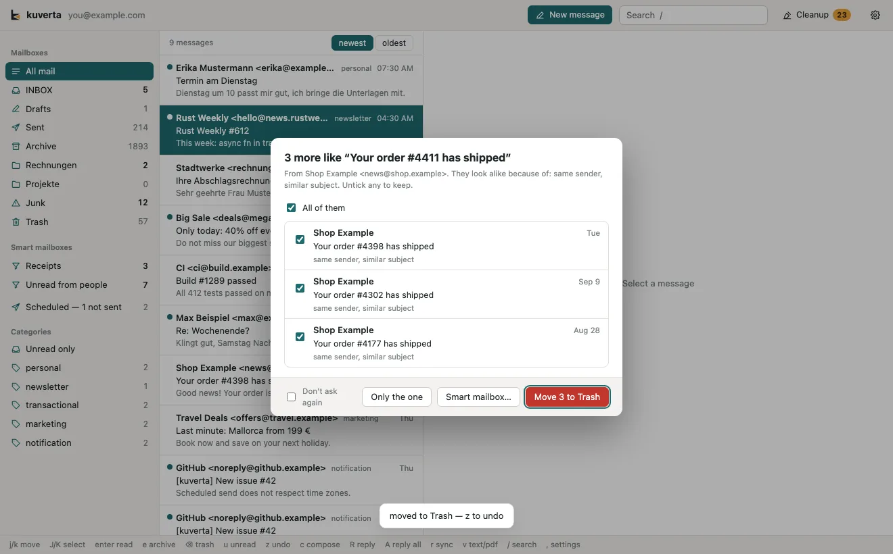

# Similar messages

Spam and bulk mail come in runs: the same shop with a new order number in the
subject, the same newsletter every week, or the same text from a different
sender each time. So when you delete a single message, kuverta looks for the
others like it and, if it finds any, asks what to do with them.

The dialog says how many it found and why they look alike. Each message is
listed — sender, date, subject, and the reason for that one — and **every one is
ticked**, so nothing goes that you did not see going. Untick the ones to keep.

- **Move N to Trash** moves the ticked ones. Each is its own queued change, so
  <kbd>z</kbd> brings them back one at a time while they wait to reach the server.
- **Smart mailbox…** opens the [smart mailbox editor](smart-mailboxes.md) with
  rules that would gather these and the next one like them, to deal with later.
- **Only the one** leaves them where they are.

## What counts as similar

kuverta compares the deleted message with the recent mail of the same account
(outside the Trash) and gives the first reason that fits:

| Reason shown | Means |
| --- | --- |
| same mailing list | The same `List-Id`. |
| same sender, similar subject | The same address, with a subject built the same way — or nearly the same text. |
| same subject / same subject, same domain | The very same subject line. |
| nearly the same text | Near-identical text from different senders: what a spam run looks like. |
| same domain, similar subject | The same sending domain and a similar subject. |

## Turning it off

Tick **Don't ask again** in the dialog. To have it back, tick **After deleting a
message, offer to delete messages like it too** in **Settings → General**.
