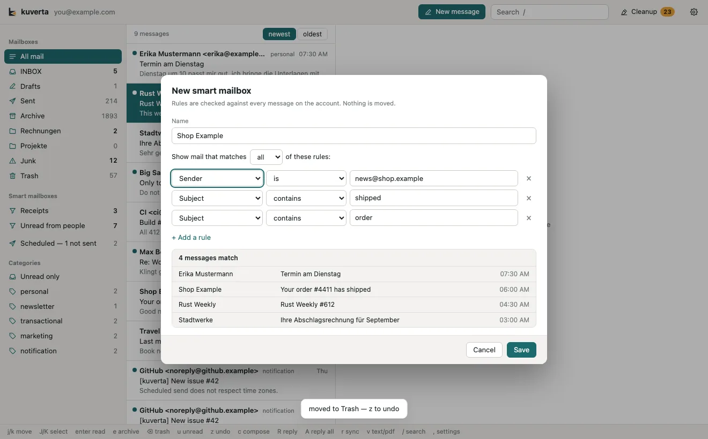

# Smart mailboxes

A smart mailbox gathers mail by rules — who sent it, what it says, how old it
is — without moving any of it. It sits in the sidebar under **Smart mailboxes**
and works like any mailbox: click it to see what it gathers, with its unread and
total counts beside it, and narrow it further by category.

Smart mailboxes belong to one account and look at every message of that
account, whichever mailbox it is in.

## Making one

- Press **+** beside *Smart mailboxes* in the sidebar,
- **New smart mailbox…** in Settings → Smart mailboxes, or
- **Smart mailbox…** when kuverta offers [similar messages](similar.md) after a
  delete — the editor then opens with rules that would catch the next one.

Give it a name, choose whether mail has to match **all** or **any** of the rules,
and add rules with **+ Add a rule** (**×** removes one). The box at the bottom
shows what the rules gather **while you write them** — how many messages match,
and the first few — so a rule that matches nothing is obvious before you save.
Rules still being typed are left out of the preview rather than shown as errors.

**Save** creates it and opens it.

To change or delete one, right-click it in the sidebar and choose **Edit…** or
**Delete**, or use the list in Settings → Smart mailboxes. Deleting a smart
mailbox deletes no mail; it only stops gathering it.

## Rules

| Field | Comparisons | Value |
| --- | --- | --- |
| **Sender** | contains, does not contain, is, is not, begins with, ends with | the sender's name and address, e.g. `@shop.example` or `Erika` |
| **Recipient** | contains, does not contain, is, is not, begins with, ends with | the To and Cc addresses |
| **Subject** | contains, does not contain, is, is not, begins with, ends with | text |
| **Message text** | contains, does not contain | words, searched in the text of the message |
| **Category** | is, is not | personal, newsletter, marketing, transactional, notification, unknown |
| **Mailing list** | contains, does not contain, is, is not, begins with, ends with | the list's id (`List-Id`), e.g. `news.example` |
| **Mailbox** | is, is not, contains | any mailbox the message has a copy in, e.g. `Archive`; names are offered as you type |
| **Unread** | is | yes or no |
| **Has an attachment** | is | yes or no |
| **Can be unsubscribed from** | is | yes or no — whether the mail carries `List-Unsubscribe` |
| **Older than (days)** | | sent more than this many days ago |
| **Received in the last (days)** | | sent within this many days |

Text comparisons ignore upper and lower case: `rechnung` finds *Rechnung*.

A few examples:

| Smart mailbox | Match | Rules |
| --- | --- | --- |
| Receipts | any | Subject contains `receipt` · Subject contains `Rechnung` |
| Unread from people | all | Category is personal · Unread is yes |
| Old newsletters | all | Category is newsletter · Older than (days) 30 |
| Things to stop | all | Can be unsubscribed from is yes · Received in the last (days) 7 |

## Bringing them over from Thunderbird and Apple Mail

**Settings → Smart mailboxes → Look for smart mailboxes** reads:

- **Thunderbird**'s saved searches, from `virtualFolders.dat` in each of its
  profiles, and
- **Apple Mail**'s smart mailboxes, from its `SmartMailboxes.plist`. macOS only
  lets a program read that with **Full Disk Access** (System Settings → Privacy &
  Security); without it, kuverta says so.

Each one found is listed with its rules as kuverta understood them, and which
account it will go to — the account it belonged to, when kuverta can match it,
otherwise the account you are looking at. Tick the ones you want and press
**Import the chosen ones**.

The rules of the three programs do not line up exactly, so an import translates
what it can and **lists what it could not carry over** under the smart mailbox,
as *Left out: …*. A smart mailbox with none of its rules left cannot be ticked.
Leaving a rule out silently would make a smart mailbox gather more than the
original and look right while doing it.

Importing twice does not make duplicates: one that already exists with the same
name on that account is shown as *already imported*. Imported smart mailboxes
are marked **Thunderbird** or **Apple Mail** in the settings list, and are
ordinary smart mailboxes from then on.
