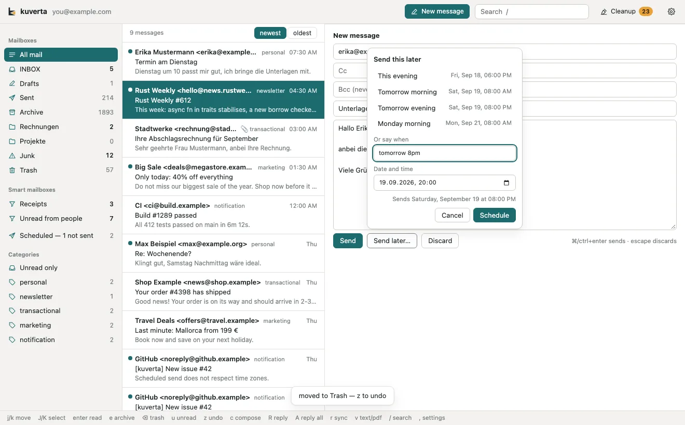
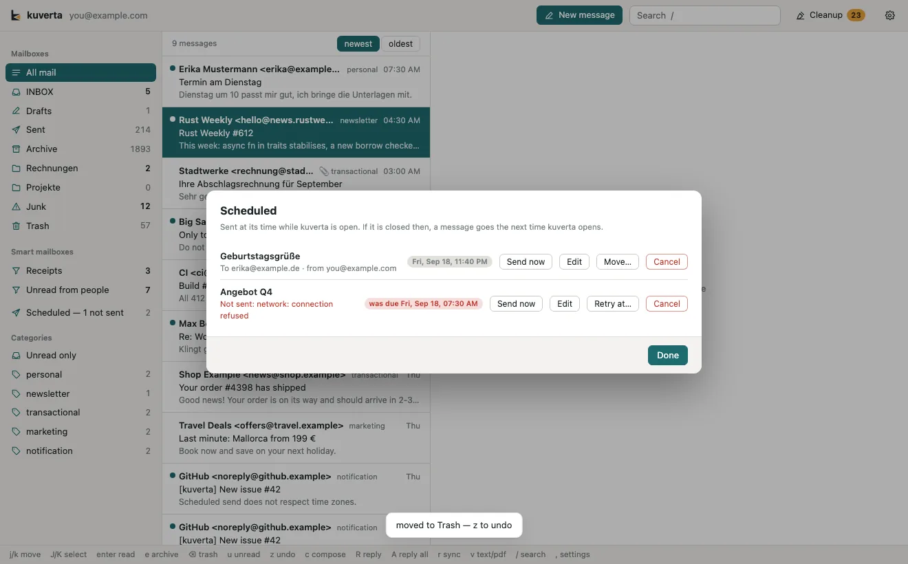

# Writing

## New message, reply, reply all, forward

| | Key | Button |
| --- | --- | --- |
| New message | <kbd>c</kbd> | **New message** in the header |
| Reply to the sender | <kbd>R</kbd> | **Reply** above the open message |
| Reply to everyone | <kbd>A</kbd> | **Reply all** |
| Forward | <kbd>f</kbd> | **Forward** |

The keys are case-sensitive: <kbd>R</kbd> and <kbd>A</kbd> are capitals
(<kbd>r</kbd> is sync). They act on the message under the cursor in the list,
and every one of them is also a button — a reply should never depend on knowing
which key it is.

Compose opens in the reading pane. For a reply, kuverta fills in the recipients
and the subject; **reply all** leaves you out of the recipients and honours the
original's `Reply-To`. A forward starts with an empty **To**.

### The fields

- **To**, **Cc** and **Bcc** take addresses separated by commas.
- **Bcc** never appears in the message itself — blind recipients are only in the
  envelope the server delivers to.
- The line beside the title shows **who will actually receive it**, Bcc
  included, and updates as you change the recipients. It is worth a glance
  before sending: it is the only place a blind recipient is shown.
- **Sign** and **Encrypt** appear when you have OpenPGP keys; see
  [Encryption](encryption.md).

### Sending

**Send**, or <kbd>⌘</kbd>/<kbd>Ctrl</kbd>+<kbd>Enter</kbd>. The message is
handed to the account's outgoing (SMTP) server, and a copy is filed in the
account's Sent mailbox. If sending worked but filing the copy did not, kuverta
says so — and does not claim the message failed, which would invite sending it
twice.

**Discard**, or <kbd>Esc</kbd>, closes compose and throws the message away.
kuverta does not keep drafts of what you discard.

An account needs an outgoing server to send; it is set under **Outgoing mail**
in the account's settings.

!!! note "Not yet"
    Attachments cannot be added in compose yet, and there is no rich text: mail
    is written as plain text.

## Send later

**Send later…** beside Send asks when.

- **Presets**: *This evening* (18:00, before four in the afternoon — later in the
  day it offers *In an hour* instead), *Tomorrow morning* (8:00), *Tomorrow
  evening* (20:00) and *Monday morning* (8:00). One click schedules it.
- **Or say when**: type it the way you would say it, in English or German:

    | You type | Means |
    | --- | --- |
    | `tomorrow 8pm` | tomorrow at 20:00 |
    | `monday 9:00` | next Monday at 9:00 — on a Monday, the one after |
    | `in 2 hours`, `in 30 min`, `in 3 days` | from now |
    | `morgen 20 Uhr` | tomorrow at 20:00 |
    | `Montag morgen` | Monday at 8:00 |
    | `24.12. 18:00`, `2026-12-24 18:00`, `24 dec 6pm` | that date and time |
    | `tonight` | today at 20:00 |
    | `evening 8`, `8 abends` | 20:00 — today, or tomorrow if that has passed |
    | `tomorrow` | tomorrow at 8:00, the start of a working day |

- **Date and time**: a calendar and clock, for when typing is more trouble.

Whichever way you choose, the time is **read back in full** — for example
"Sends Saturday, September 19 at 20:00" — before **Schedule** is possible. A time that has
already passed, or text kuverta is not sure about, is not accepted; it asks
again rather than guess.

The message is **checked when you schedule it**: it is built exactly as sending
it would build it, so a mistyped address is refused now, while you are looking,
rather than failing at eight in the morning with nobody watching.

!!! warning "kuverta sends it, so kuverta has to be running"
    Scheduled mail is sent by kuverta itself, not held by your mail server — no
    mail server offers that in a way every client can use. If kuverta is closed
    at the time, the message goes the next time you open it, and the list of
    scheduled mail says when it was due.

## Scheduled mail

While something is waiting, **Scheduled** appears in the sidebar with a count.
Click it for the list.

For each message:

- **Send now** sends it straight away.
- **Edit** takes it out of the schedule and back into compose, from the account
  it was going to be sent from. Send it, or schedule it again.
- **Move…** picks a new time.
- **Cancel** removes it; it will not be sent.

A message that could not be sent shows **Not sent** with the reason, and the
sidebar says *Scheduled — 1 not sent*. **Retry at…** gives it a new time, and
**Send now** tries again at once.

A send that was interrupted — kuverta closed or crashed while the message was
being handed to the server — is **never retried on its own**. It may or may not
have gone out, so it is marked as not sent with a note to check your Sent
mailbox before sending it again. Sending a message twice is the one mistake
here that cannot be taken back.
